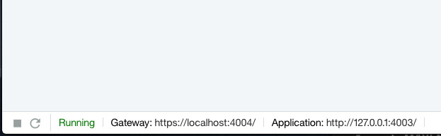

# Lab2 - APIC Designer

See: https://developer.ibm.com/apiconnect/getting-started-old/run-your-api/

1. Start the APIC Designer

    * Start the APIC Designer,

    ```console
    $ apic edit
    ```

    * The API Designer window opens,
    * Signin with your IBM Cloud account,
    * The Dashboard page opens with 4 tabs: Products, APIs, Models, and Data Sources.
    In the Products tab, you see one product `apic-api 1.0.0 [apic-api-product.yaml]`. 
    In the APIs tab, you see one API `apic-api 1.0.0 [apic-api.yaml]`.
    In the Models tab, you see one Loopback model `Post`.
    In the `Data Sources` tab, you see the built-in memory data source `db` listed.


2. Validate the application specification,
    * Go to APIs and open the `apic-api 1.0.0 [apic-api.yaml]` API in the designer,
    * A back button to `All APIs` and three tabs appear: Design, Source, and Assemble tabs.
    * Run the API validator in the `Design` tab,
    * Review the Warnings,

    ```
    1 warning
        Definition is not used: #/definitions/x-any 
        Show me 
        definitions: x-any
    ```
    * You can ignore the warning,

3. Edit the API,
    * In the designer,
    
    * Go to the `Info` section, and update the `Version` to `1.1.0`,

    * Go to the `Schemes` section, and enable `http`. Because we do not have a valid certificate, the `https` requests will fail, therefor we have to enable the http protocol.
    
    * Go to the `Host` section, and make sure `Host` is set to `$(catalog.host)`,

    * Go to the `Lifecycle` section, and make sure that the API is enforced to use a Gateway,

    * For the Security see also the documentation section for [Configuring API security by using the API Designer](https://www.ibm.com/support/knowledgecenter/en/SSFS6T/com.ibm.apic.toolkit.doc/tapim_sec_api_config.html). You can secure the APIs with Basic Authentication, API key, or OAuth. If you use an API Key, you can select 1 of 4 options:
        * Client ID in Header,
        * Client Secret in Header,
        * Client ID in Query,
        * Client Secret in Header.

    * Go to the `Security Definitions` section and review `clientIdHeader` and `clientSecretHeader`,
    * Go to the `Security` section and review the security option `clientIdHeader` and `clientSecretHeader`, 

        * 
        
    * Go to the `Paths` section, 
        * Delete the following endpoints:
            * `Posts/replaceOrCreate`,
            * `/Posts/upsertWithWhere`,
            * `/Posts/{id}/exists`,
            * Delete the `/Posts/{id}/replace` endpoint, 
            * Delete the `/Posts/findOne` endpoint, 
            * Delete the `/Posts/count` endpoint,

        * Open the `/Posts` endpoint, you see 4 access methods: POST, PATCH, PUT and DELETE. 
            * Review the `POST /Posts` endpoint,
            * Delete `PATCH /Posts`,
            * Edit `PUT /Posts` and change the operationId from `Post.replaceOrCreate__put_Posts` to `Post.updateAll`,
            * Edit the `GET /Posts` endpoint,
                * In the Security section, disable the `Use API security definitions`,

        * Open the `/Posts/{id}` endpoint,
            * Edit `HEAD /Posts/{id}` and change the operationId from `Post.exists__head_Posts_{id}` to `Post.existsById`,
            * Edit the `GET /Posts/{id}` endpoint,
                * In the Security section, disable the `Use API security definitions`,
            * Edit `PUT /Posts/{id}` and change the operationId from `Post.replaceById__put_Posts_{id}` to `Post.updateById`,
            * Review `DELETE /Posts/{id}`,
            * Delete `PATCH /Posts/{id}`, 

    * Go to the `Definitions` section,
        * Delete the `x-any` definition,

    * Validate the API design,
    * Save the API design,

    * From the top right dropdown, select `Add to existing products`
        * Select the product `apic-api 1.0.0`
        * Click `Add`.
    * Click the back button for `All APIs`,
    * Go to the `Products` tab, and refresh the page,
    * Click the product `apic-api 1.0.0`,
        * If a `Referenced file not found` error shows, go directly in the source file `definitions/apic-api-product.yaml` and make sure the `apis` property is correctly defined,

        ```
        apis:
          apic-api:
            $ref: apic-api.yaml
        ```

        * Refresh the page, go to `Products` and click the `apic-api 1.0.0` again, the page should load and under `APIs` you should see `apic-api 1.1.0` with the latest version added,

    **Note** So far we have been making updates to product version 1.0.0. If you want to update the product version, you need to save your draft as a new version, instead of adding the update to an existing product.


4. Start the test servers, 

    * Go to the API Connect editor in http://127.0.0.1:9000/#/design/apis,
    * Refresh the page if needed,
    * Make sure the test servers are running by clicking the play button in the bottom left of your browser, You should see both a `Gateway` and `Application` running,
    * If needed, start the test servers by clicking the play icon or the refresh icon in the bottom left of the browser,

    

    * Click the clickable link for `Application` and verify the host and port under which your application is running in the bottom left. For example click the link `Application: http://127.0.0.1:4003/` to open the test server, you should see the server status displayed,

    ```
    {"started":"2019-07-14T16:23:27.430Z","uptime":123.372}
    ```

* Try out the Explorer,

    * In the API Connect Editor, click the `Explore` button,
    * The API Connect Explorer will open,
    * In the left column, click the `Post.create` method,
        * In the right column, click the `Try it` button for the `Post.create` method,
        * In the `Scheme` drop down, select the `http` protocol,
        * Scroll down to the `data` section and click the `Generate` link,
        * Remove the `id`, the Loopback data source will generate the id,
        * Change the `userId` to `1`,

            ```
            {
                "title": "giljur",
                "subtitle": "aceanze",
                "publicationDate": "2019-01-07T13:50:29.519Z",
                "text": "waew",
                "userId": 1
            }
            ```

        * Click the `Call operation` button,
        * You should get a 200 status code, and a response Post object,
    * In the left column, click the `Post.find` method,
        * In the right column, click the `Try it` button for the `Post.find` method,
        * In the `Scheme` drop down, select the `http` protocol,
        * Click the `Call operation` button,
        * You should get a 200 status code, and a response with the Post object we just created, 
    
* Add a new API version,
    * Go back to the `Drafts` in the Designer,
    * Go to the APIs tab and open the `apic-api 1.1.0`,
    * In the `Info` section, add a Description, e.g. `APIC API for managing APIC data`,
    * Run the API validator again,
    * Save the API configuration,
    * Click the drop-down menu in the top right,
    * Select `Save as a new version` option,
    * In the `Version` control add `1.2.0`,
    * Click the `Save as a new version` button,
    * Click `All APIs` and view the `APIs` tab,
    * Refresh the page, you should see two versions of your API now 1.2.0 and 1.1,0,

* Create a new Product version,
    * Go to the Products tab and open the `apic-api 1.0.0`,
    * In the `Info` section, update the version to `1.2.0`,
    * Add a Description, e.g. `APIC API for managing APIC data`,
    * In the `APIs` section, 
        * Remove the `apic-api 1.1.0` version, and confirm `OK`,
        * Click the `plus` icon to add a new API,
        * Select the `apic-api 1.2.0` version, and click `Apply`,
        * Click the `Save` icon,
        * Click the drop-down menu in the top right,
        * Select `Save as a new version` option,
        * In the `Version` control add `1.2.0`,
        * Click the `Save as a new version` button,
        * Click `All Products` and view the `APIs` tab,
        * Refresh the page, you should see two versions of your Product now 1.2.0 and 1.1,0,
